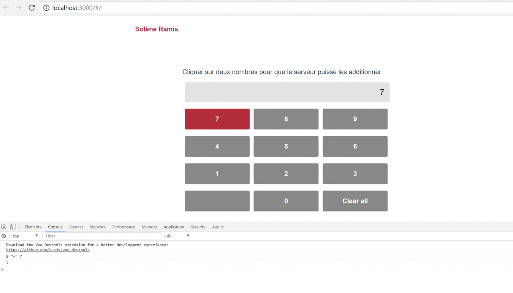

# Test Calculatrice - ARTE STUDIO LAB

> Calculatrice JS : Client : Framework VueJS && Serveur : Infrastructure Web ExpressJS

> solene.ramis@gmail.com

# Pour commencer

````
# clone :
  git clone https://github.com/SoleneRamis/TestCalculatrice.git
````

````
# ouvrir deux terminaux :
  l. Pour le serveur
      * cd TestCalculatrice/Serveur
      * npm install
      * npm run server

  2. Pour le client
      * cd TestCalculatrice/Client
      * npm install
      * npm run dev
````

<hr>


# Projet

````
Développer une calculatrice permettant d'additionner deux nombres.
Elle doit se composer d'un client web et d'un serveur distant.
Le calcul doit s'effectuer sur le serveur distant et prendre quelques secondes (simuler un temps de calcul éventuellement)
````

<hr>



# Client http://localhost:3000

````
  * Récupére les nombres au click des boutons
  * Fait un request post vers le serveur avec en paramétre les deux nombres
  * Attend la réponse du serveur
  * Affiche la reponse du serveur
````
> pourrait etre : une application mobile, un site, une objet connecté...

# Server http://localhost:7000

````
  * Route post reçoit deux nombres
  * Puis effectue le calcul (addition)
  * Enfin retourne la reponse du calcul
````
> serveur php, nodejs, python ...

<hr>

# Documentation

### [Vue js](https://vuejs.org/)

````
# installation de vue js :
  npm install vue
````
````
# installation vue-cli :
  npm install --global vue-cli
````
````
# Créer un nouveau projet en utilisant "webpack" :
  vue init webpack my-project
````
````
# installation des dépendances :
  cd my-project
  npm install
  npm run dev
````
````

# Démarrer le développement en localhost sur le port 8080 :
  npm run dev
````

### [Express js](http://expressjs.com/fr/)

````
# information sur l'application :
  npm init
````
````
# installation des dépendances :
  npm install express --save
````
````
# Routage :
  var express = require('express');
  var app = express();

  // respond with "hello world" when a GET request is made to the homepage
  app.get('/', function(req, res) {
    res.send('hello world');
  });
````
